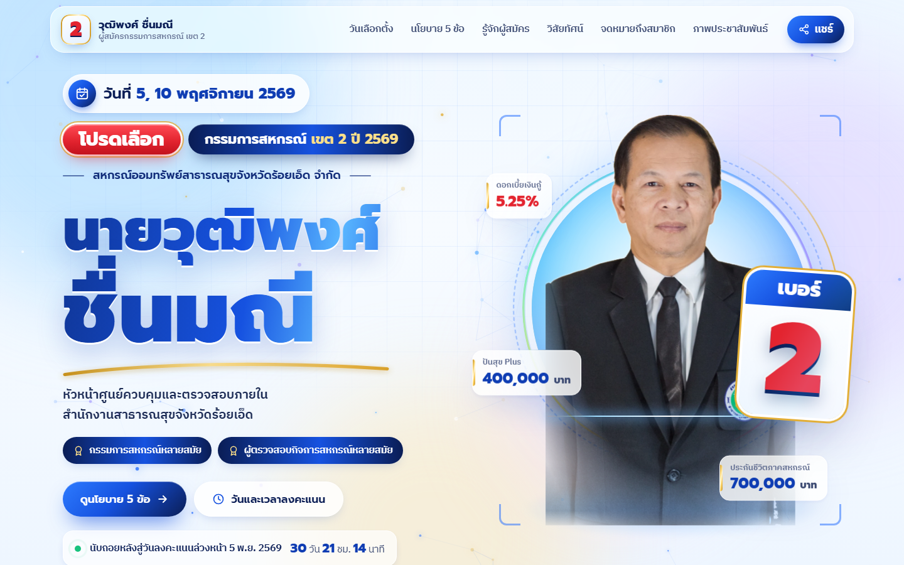

# นายวุฒิพงศ์ ชื่นมณี เบอร์ 2

เว็บไซต์ประชาสัมพันธ์ผู้สมัครกรรมการสหกรณ์ เขต 2 ปี 2569
สหกรณ์ออมทรัพย์สาธารณสุขจังหวัดร้อยเอ็ด จำกัด • เลือกตั้งวันที่ 5 และ 10 พฤศจิกายน 2569

**ดูเว็บไซต์:** https://thonganek.github.io/Wuttipong_No2/

## เนื้อหาในเว็บ

วันและเวลาลงคะแนน พร้อมนับถอยหลัง • นโยบาย 5 ข้อ • ประวัติและประสบการณ์ • ผลงาน • 10 แนวทางพัฒนาสหกรณ์ • จดหมายถึงสมาชิก • ภาพประชาสัมพันธ์ 12 ภาพ

ข้อมูลอ้างอิงจากเอกสารข้อมูลผู้สมัครและโปสเตอร์ประชาสัมพันธ์ ปี 2569

## ธีมและเอฟเฟกต์

โทนโฮโลแกรมสว่างตามโปสเตอร์: ฟ้า ขาว น้ำเงินเข้ม ทอง และเลข 2 สีแดง

- หน้าโหลดวงแหวนโฮโลแกรม พื้นหลังแสงเคลื่อนไหว อนุภาคแสงในส่วนแรก
- ภาพผู้สมัครแบบตัดพื้นหลัง พร้อมวงแหวนหมุน ลำแสงสแกน และการ์ด "เบอร์ 2" ที่เอียงตามเมาส์
- ริบบิ้นทอง/น้ำเงินวิ่ง นับถอยหลังวันลงคะแนนแบบเรียลไทม์ ตัวเลขนโยบายนับขึ้น
- แกลเลอรีกรองตามหมวด ดูภาพขยาย เลื่อน/ปัดดูภาพถัดไป และดาวน์โหลด
- ผู้ที่ตั้งค่าลดการเคลื่อนไหวในเครื่อง จะเห็นหน้าแบบนิ่งอัตโนมัติ

## แก้ไขและเปิดในเครื่อง

ดับเบิลคลิก `index.html` ได้ทันที หรือรัน `python -m http.server 8765` แล้วเปิด http://localhost:8765

- `index.html` — เนื้อหาทั้งหมดของหน้าเว็บ
- `css/campaign.css` — ธีมและการจัดหน้าสำหรับมือถือ/คอมพิวเตอร์
- `js/campaign.js` — เอฟเฟกต์ นับถอยหลัง แกลเลอรี และปุ่มแชร์
- `assets/photos/` — ภาพขนาดเต็ม, `assets/photos/thumbs/` — ภาพย่อสำหรับแกลเลอรี

เมื่อ push ขึ้น branch `main` แล้ว GitHub Pages จะอัปเดตเว็บให้อัตโนมัติภายในไม่กี่นาที

## ตารางเทียบรูปภาพกับไฟล์ต้นฉบับ

| ไฟล์ในเว็บ (`assets/photos/`) | ไฟล์ต้นฉบับ | ใช้ในส่วน |
|---|---|---|
| `01-office-wai.jpg` | `7400898_0.jpg` (ตัดแถบปุ่มโทรศัพท์ด้านล่างออก) | แกลเลอรี |
| `02-ceremony-wai.jpg` | `7429482.jpg` | จดหมายถึงสมาชิก, แกลเลอรี |
| `03-workplace-portrait.jpg` | `7448149.jpg` | แกลเลอรี |
| `04-heart-sofa.jpg` | `7456739.jpg` | แกลเลอรี |
| `05-garland-heart.jpg` | `7475755.jpg` | ส่วนปิดท้าย, แกลเลอรี |
| `06-coop-office-front.jpg` | `7494520_0.jpg` | เขตพื้นที่เลือกตั้ง, แกลเลอรี |
| `07-coop-office-standing.jpg` | `7494523_0.jpg` | แกลเลอรี |
| `08-studio-portrait.jpg` | `IMG_0513_0.jpg` | ภาพหลัก (`hero-cutout.webp` ตัดพื้นหลัง), แกลเลอรี |
| `09-studio-arms-crossed.jpg` | `IMG_0517_0.jpg` | รู้จักผู้สมัคร, แกลเลอรี |
| `10-poster-policies.jpg` | `LINE_ALBUM_หาเสียง69_261005_1.jpg` | แกลเลอรี, ภาพตัวอย่างเมื่อแชร์ลิงก์ |
| `11-poster-letter.jpg` | `LINE_ALBUM_หาเสียง69_261005_2.jpg` | แกลเลอรี |
| `12-environmental-health-day.jpg` | `LINE_ALBUM_หาเสียง69_261005_3.jpg` | แกลเลอรี |
